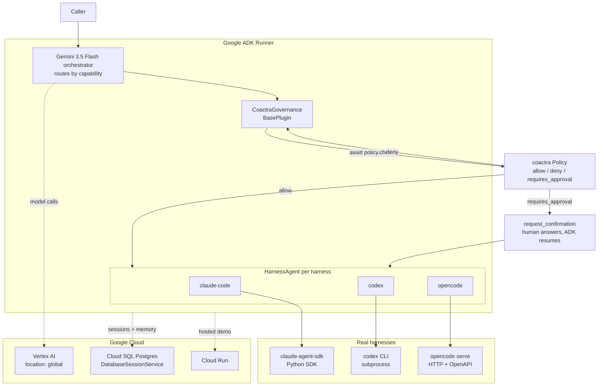

# adk-harness

Turn any coding-agent harness into a governed Google ADK agent.

Claude Code, Codex, and opencode have nothing in common — one is a Python SDK,
one is a CLI, one is an HTTP server. `adk-harness` puts all three behind a single
protocol, presents each as a Google ADK agent, and routes a Gemini orchestrator
across them while one policy gate sees every tool call before it runs.

It is a library. There is no service to run and no web app to deploy — you
`pip install` it and import it.

```python
from adk_harness import build_fleet
from coactra import Policy

fleet = build_fleet(
    policy=Policy.default_deny(),
    model="gemini-3.5-flash",
    harnesses=["claude-code", "codex"],
)

async for turn in fleet.run("Fix the failing tests in ./api", cwd="./api"):
    print(turn)
```

## Why

Teams already run several coding agents. Each one authenticates differently,
logs differently, and decides for itself what it is allowed to touch. There is no
single place to say "this fleet may edit source but must ask a human before
touching production config" and have every agent obey it.

`adk-harness` makes that place exist. Policy is evaluated once, in one plugin,
before any harness acts — regardless of which vendor is doing the work.

## Architecture



Every tool call from every harness passes `CoactraGovernance.before_tool_callback`
before it executes. Because ADK's `AgentTool` defaults to `include_plugins=True`,
that stays true whether a harness is used as a sub-agent or as a tool.

## Fleet-track components

| Component | Where it lives |
|---|---|
| Agent Registry | `HarnessRegistry` — discovery, versioning, capability lookup |
| Agent Runtime | Each harness is an ADK `BaseAgent` inside ADK's runner |
| Memory Bank | `DatabaseSessionService` on Cloud SQL, surviving process restart |
| Agent Identity | `coactra.Scope` on every policy request |
| Agent Gateway | One orchestrator, one plugin, one policy |
| Model Armor | The plugin denies or pauses before a harness touches a repo |
| Observability | ADK OpenTelemetry output plus a per-decision policy audit trail |

## Install

```bash
pip install "adk-harness[all]"
```

Adapters are optional. The base install pulls only ADK and Coactra; a harness you
have not installed reports `available=False` instead of failing an import.

```bash
pip install adk-harness                  # protocol, registry, governance
pip install "adk-harness[claude-code]"   # + claude-agent-sdk
pip install "adk-harness[opencode]"      # + httpx for the opencode server
```

Codex needs no extra — it is driven as a subprocess, so install the `codex` CLI
yourself and `adk-harness` will discover it.

## Spin-up

Requires Python 3.12+, a Google Cloud project with billing, and the `gcloud` CLI.

```bash
gcloud auth application-default login
gcloud config set project YOUR_PROJECT_ID
gcloud auth application-default set-quota-project YOUR_PROJECT_ID
gcloud services enable aiplatform.googleapis.com run.googleapis.com
```

```bash
export GOOGLE_GENAI_USE_VERTEXAI=true
export GOOGLE_CLOUD_PROJECT=YOUR_PROJECT_ID
export GOOGLE_CLOUD_LOCATION=global
```

```bash
pip install -e ".[dev,all]"
python -m pytest -q
```

### The `global` location is not optional

`gemini-3.5-flash` resolves **only** on the `global` Vertex location. It returns
HTTP 404 in `us-central1`, while `gemini-2.5-flash` works in both — so getting
this wrong fails late rather than immediately. Keep `GOOGLE_CLOUD_LOCATION=global`
even when the Cloud Run service itself is deployed to a region.

### Deploy the example fleet

```bash
adk deploy cloud_run --project=YOUR_PROJECT_ID --region=us-central1 --with_ui ./examples/fleet
```

`--with_ui` serves ADK's own dev UI, so the deployment doubles as the demo
surface. The library is the deliverable; the deployment is evidence it runs on
Google Cloud.

## Writing an adapter

Implement one protocol. `src/adk_harness/protocol.py` is the whole contract.

```python
class Harness(Protocol):
    spec: HarnessSpec
    async def discover(self) -> HarnessSpec: ...
    def run(self, prompt: str, *, cwd: str, session_id: str | None = None) -> AsyncIterator[HarnessTurn]: ...
    async def aclose(self) -> None: ...
```

Four rules:

1. An adapter never decides whether an action is permitted. It streams turns; the
   governance plugin decides.
2. Import your vendor SDK inside `discover()`, never at module import time, so a
   missing harness degrades to `available=False`.
3. `HarnessTurn.raw` is opaque. The core never branches on vendor payload shape.
4. `run()` streams. No adapter buffers a whole session.

## Status and roadmap

| Harness | Shape | State |
|---|---|---|
| Codex | CLI subprocess | Implemented |
| Claude Code | Python SDK | Implemented |
| opencode | HTTP + OpenAPI | Planned |
| Hermes Agent | — | Not planned for v1 |
| DeepSeek Harness | — | Not planned for v1 |

Hermes Agent and DeepSeek Harness are general agent runtimes rather than
coding-first agents, and DeepSeek Harness is a v0.1 developer preview that
guarantees breaking changes. Two adapters across two genuinely different
integration shapes prove more about the protocol than five shallow ones would.

## License

MIT
