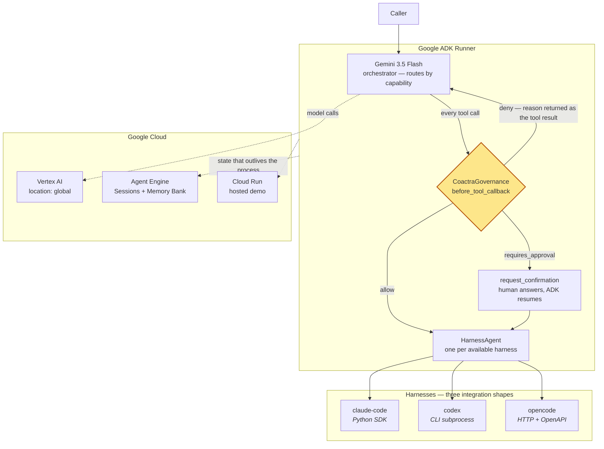

# adk-harness

Turn any coding-agent harness into a governed Google ADK agent.

Claude Code, Codex, and opencode have nothing in common — one is a Python SDK,
one is a CLI, one is an HTTP server. `adk-harness` puts all three behind a single
protocol, presents each as a Google ADK agent, and routes a Gemini orchestrator
across them while one policy gate sees every tool call before it runs.

It is a library. There is no service to run and no web app to deploy — you
`pip install` it and import it.

```python
import asyncio

from adk_harness import HarnessRegistry, build_fleet
from adk_harness.adapters import ClaudeCodeHarness, CodexHarness
from coactra import Policy, Scope
from google.adk.runners import Runner
from google.adk.sessions import InMemorySessionService
from google.genai import types


async def main() -> None:
    fleet = await build_fleet(
        registry=HarnessRegistry([ClaudeCodeHarness(), CodexHarness()]),
        policy=Policy.default_deny(),
        scope=Scope(tenant_id="acme", namespace="fleet"),
        cwd="./api",
    )
    print("available:", fleet.available_ids)

    session_service = InMemorySessionService()
    runner = Runner(app=fleet.app, session_service=session_service)
    await session_service.create_session(
        app_name=fleet.app.name, user_id="u", session_id="s"
    )
    message = types.Content(
        role="user", parts=[types.Part(text="Fix the failing tests in ./api")]
    )
    async for event in runner.run_async(
        user_id="u", session_id="s", new_message=message
    ):
        if event.content and event.content.parts:
            for part in event.content.parts:
                if part.text:
                    print(part.text)

    for record in fleet.governance.audit:
        print(record.outcome, record.tool_name, record.reason)


asyncio.run(main())
```

A harness you have not installed reports `available=False` and is simply left
out of the fleet — nothing raises.

## Why

Teams already run several coding agents. Each one authenticates differently,
logs differently, and decides for itself what it is allowed to touch. There is no
single place to say "this fleet may edit source but must ask a human before
touching production config" and have every agent obey it.

`adk-harness` makes that place exist. Policy is evaluated once, in one plugin,
before any harness acts — regardless of which vendor is doing the work.

> **Want to see it work without running it?** [docs/PROOF.md](docs/PROOF.md)
> has captured output from real runs — the precedent loop against live Gemini,
> and all three governance outcomes against a deployed Cloud Run service.

## The precedent loop

A policy that says "a human must decide" is correct and expensive. Ask a person
the same question every morning and they stop reading the question — they just
click approve. At that point the approval prompt has become a formality, which
is worse than not having one, because it looks like oversight while providing
none.

So when policy says a human must decide, the gate first asks whether a human
*already* decided this, under conditions that still hold:

```
policy says requires_approval
   └─ does a precedent admit these facts?
        ├─ exactly one, still valid  → apply it, no interruption
        ├─ none                      → ask the human, then remember the answer
        ├─ several that disagree     → ask; do not guess
        └─ one, past its review date → ask; a stale answer is not an answer
```

Admission is by hard predicate, never by similarity. Every `Applicability` on a
precedent must hold against the facts of the call, and **a missing fact is never
a pass** — if the precedent constrains `path` and the call has no `path`, it does
not apply. Similarity only ranks candidates that were already admitted, so no
amount of "this looks close enough" can let one in. There is no model call
anywhere in `precedent.py`.

Two properties are pinned by tests because everything rests on them:

- **Precedent never overrides a `deny`.** It only removes a repeated question,
  never the gate itself.
- **A precedent's scope is set by the human, not inferred.** `remember()` takes
  `applicability` explicitly, so a casual "yes, that's fine" cannot silently
  become a broad standing policy.

```python
# The human answered once. Their answer had a scope.
fleet.governance.remember(
    tool_name="run_codex",
    precedent_id="pr-2026-08-25-tests",
    applicability=[Applicability("cwd", "startswith", "/work/repo/tests")],
    decision={"approve": True},
    rationale="Test files are safe to edit without review.",
    confirmed_by="dave",
)
```

Tomorrow the same question is not asked. A different question still is.

## Architecture



Every tool call from every harness passes `CoactraGovernance.before_tool_callback`
before it executes. Because ADK's `AgentTool` defaults to `include_plugins=True`,
that stays true whether a harness is used as a sub-agent or as a tool.

## What is where

| Concern | Where it lives |
|---|---|
| Registry | `HarnessRegistry` — discovery, versioning, capability lookup |
| Runtime | Each harness is an ADK `BaseAgent`; sessions via ADK or Vertex AI Agent Engine |
| Learned decisions | `PrecedentStore` — hard-predicate admission, no model call |
| Identity | `coactra.Scope` on every policy request |
| Gateway | One orchestrator, one plugin, one policy, one audit trail |
| Enforcement | The plugin allows, pauses, or denies before a harness is dispatched |
| Observability | ADK OpenTelemetry output plus a per-decision policy audit trail |

### What the gate does and does not cover

Dispatch is gated: whether *this harness* may work in *this directory* on *this
task* is a policy decision, and `governance.py` keys the policy resource on
`cwd` for that reason.

The tool calls a harness makes inside its own run are **observed, not gated** —
they execute in the harness's own process and never return through ADK.
`HarnessAgent` surfaces them as events so they land in the transcript, and says
so in its docstring rather than letting the audit trail imply more coverage than
it has.

## Install

```bash
pip install "adk-harness[all]"
```

Adapters are optional. The base install pulls only ADK and Coactra; a harness you
have not installed reports `available=False` instead of failing an import.

```bash
pip install adk-harness                  # protocol, registry, governance
pip install "adk-harness[claude-code]"   # + claude-agent-sdk
pip install "adk-harness[opencode]"      # + httpx for the opencode server
```

Codex needs no extra — it is driven as a subprocess, so install the `codex` CLI
yourself and `adk-harness` will discover it.

## Spin-up

Requires Python 3.12+, a Google Cloud project with billing, and the `gcloud` CLI.

```bash
gcloud auth application-default login
gcloud config set project YOUR_PROJECT_ID
gcloud auth application-default set-quota-project YOUR_PROJECT_ID
gcloud services enable aiplatform.googleapis.com run.googleapis.com
```

```bash
export GOOGLE_GENAI_USE_ENTERPRISE=true   # GOOGLE_GENAI_USE_VERTEXAI still works but is deprecated
export GOOGLE_CLOUD_PROJECT=YOUR_PROJECT_ID
export GOOGLE_CLOUD_LOCATION=global
```

```bash
pip install -e ".[dev,all]"
python -m pytest -q
```

### The `global` location is not optional

`gemini-3.5-flash` resolves **only** on the `global` Vertex location. It returns
HTTP 404 in `us-central1`, while `gemini-2.5-flash` works in both — so getting
this wrong fails late rather than immediately. Keep `GOOGLE_CLOUD_LOCATION=global`
even when the Cloud Run service itself is deployed to a region.

### Deploy the example fleet

```bash
adk deploy cloud_run --project=YOUR_PROJECT_ID --region=us-central1 --with_ui ./examples/fleet
```

`--with_ui` serves ADK's own dev UI, so the deployment doubles as the demo
surface. The library is the deliverable; the deployment is evidence it runs on
Google Cloud.

## Writing an adapter

Implement one protocol. `src/adk_harness/protocol.py` is the whole contract.

```python
class Harness(Protocol):
    spec: HarnessSpec
    async def discover(self) -> HarnessSpec: ...
    def run(self, prompt: str, *, cwd: str, session_id: str | None = None) -> AsyncIterator[HarnessTurn]: ...
    async def aclose(self) -> None: ...
```

Five rules, stated in full in [docs/agents/CONTRACT.md](docs/agents/CONTRACT.md):

1. An adapter never decides whether an action is permitted. It streams turns; the
   governance plugin decides.
2. Import your vendor SDK inside `discover()`, never at module import time, so a
   missing harness degrades to `available=False`.
3. `discover()` must not raise. A missing or broken harness reports
   `available=False` with the reason in `detail`.
4. `HarnessTurn.raw` is opaque. The core never branches on vendor payload shape.
5. `run()` streams. No adapter buffers a whole session.

## Status and roadmap

| Harness | Shape | State |
|---|---|---|
| Codex | CLI subprocess | Implemented |
| Claude Code | Python SDK | Implemented |
| opencode | HTTP + OpenAPI | Planned |
| Hermes Agent | — | Not planned for v1 |
| DeepSeek Harness | — | Not planned for v1 |

Hermes Agent and DeepSeek Harness are general agent runtimes rather than
coding-first agents, and DeepSeek Harness is a v0.1 developer preview that
guarantees breaking changes. Two adapters across two genuinely different
integration shapes prove more about the protocol than five shallow ones would.

## License

MIT
